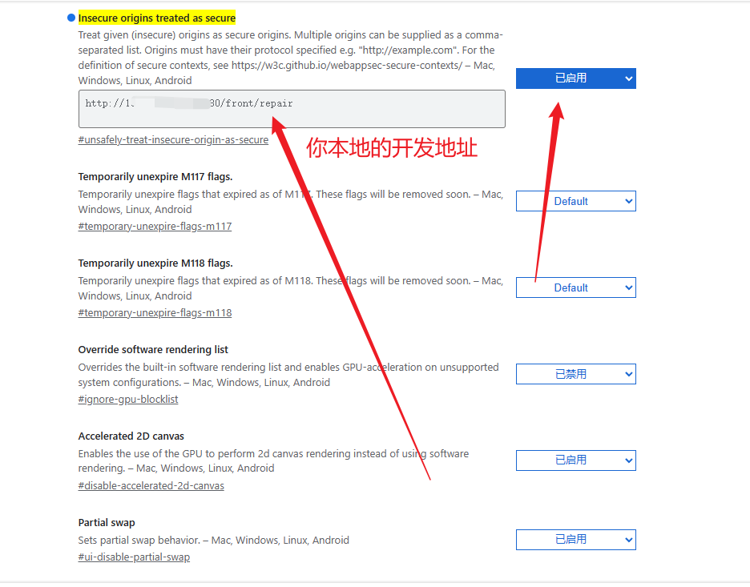

```js
 1. 安装
 npm install recorder-core

2.引入
注：如遇i8n、wav等其他莫名报错，把引入文件放在main.ts全局引入
import Recorder from 'recorder-core'
import 'recorder-core/src/engine/mp3'
import 'recorder-core/src/engine/mp3-engine'
//录制wav格式的用这一句就行
import 'recorder-core/src/engine/wav'
import 'recorder-core/src/extensions/waveview'
main.ts全局引入
app.config.globalProperties.$Recorder = Recorder
ts报错：
根目录新建ts文件，写入：declare const Recorder: any
3.使用
   <el-button @click="startRecord" type="primary" v-if="!isRecording" >
                打开录音
        <el-icon class="Microphone">
            <Microphone />
        </el-icon>
   </el-button>
   <el-button @click="stopRecord" type="primary" v-else>
                结束录音
        <el-icon class="Microphone">
            <Microphone />
        </el-icon>
    </el-button>

    // 开始录音
const startRecord = () => {
    ElMessage.info('正在打开麦克风，请稍后')
    rec.value = Recorder({
        type: 'wav', //录音格式，可以换成wav等其他格式
        sampleRate: 16000, //录音的采样率，越大细节越丰富越细腻
        bitRate: 16, //录音的比特率，越大音质越好
        onProcess: (buffers: any, powerLevel: any, bufferSampleRate: any) => {
            //录音实时回调，大约1秒调用12次本回调
            //可实时绘制波形，实时上传（发送）数据
            ;(wave.value = buffers[buffers.length - 1]), powerLevel, bufferSampleRate
        }
    })
    rec.value.open(
        () => {
            rec.value.start()
            isRecording.value = true
            ElMessage.success('麦克风已打开')
        },
        (msg: any) => {
            ElMessage.error('无法录音:' + msg)
        }
    )
}

// 关闭录音
const stopRecord = () => {
    rec.value.stop(
        async (blob: any) => {
            loading.value = true
            // 录音上传
            const formData = new FormData()
            formData.append('audio', blob)
            request
                .post('/speech/recognize', formData, {
                    headers: {
                        'Content-Type': 'multipart/form-data'
                    }
                })
                .then(response => {
                    keyWord.value = response
                    handelSelectOne(keyWord.value)
                    loading.value = false
                })
                .catch(error => {
                    console.error(error)
                })
            rec.value.close() //关闭录音，释放录音资源，当然可以不释放，后面可以连续调用start
            rec.value = null
            isRecording.value = false
            ElMessage.info('关闭麦克风')
        },
        (err: any) => {
            console.error('结束录音出错：' + err)
            rec.value.close() //关闭录音，释放录音资源，当然可以不释放，后面可以连续调用start
            rec.value = null
        }
    )
}

附注：
1.recorder-core 更多方法
rec.open(success,fail) //打开录音，请求录音权限
rec.close() //关闭录音，释放麦克风资源

rec.start() //开始录音
rec.stop(success,fail) //结束录音

rec.pause() //暂停录音
rec.resume() //恢复继续录音

//可视化插件：WaveView插件
import 'recorder-core/src/extensions/waveview'

//可视化插件：WaveSurferView插件
import 'recorder-core/src/extensions/wavesurfer.view'

//可视化插件：FrequencyHistogramView插件
import 'recorder-core/src/extensions/frequency.histogram.view'
import 'recorder-core/src/extensions/lib.fft'

//BufferStreamPlayer插件：实时播放录音片段文件，把片段文件转换成MediaStream流
import 'recorder-core/src/extensions/buffer_stream.player'

//ASR_Aliyun_Short插件：阿里云语音识别（语音转文字），支持实时语音识别、单个音频文件转文字
import 'recorder-core/src/extensions/asr.aliyun.short'

//Sonic插件：变速变调插件
import 'recorder-core/src/extensions/sonic'
```

2.浏览器使用 recorder-core 报错,提示：录音 open 失败：浏览器禁止不安全页面录音，可开启 https 解决...
在谷歌浏览器中：
在浏览器地址栏中输入：chrome://flags/#unsafely-treat-insecure-origin-as-secure
启动选项，并且添加你本地的开发地址

<div align="center">
  
</div>

Edge：
edge://flags/#unsafely-treat-insecure-origin-as-secure
操作同谷歌

火狐浏览器：
在浏览器地址栏输入：about:config
勾选（当我尝试修改底层首选项时警示我）
点击“接受风险并继续”。
搜索框输入 insecure，然后回车搜索相关设置选项。
media.devices.insecure.enabled 改为 true。
media.getusermedia.insecure.enabled 改为 true。
刷新你的网页重试即可
