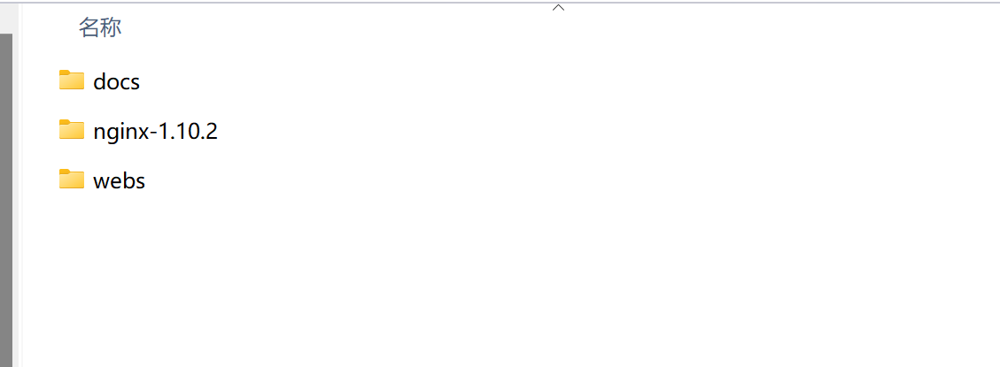
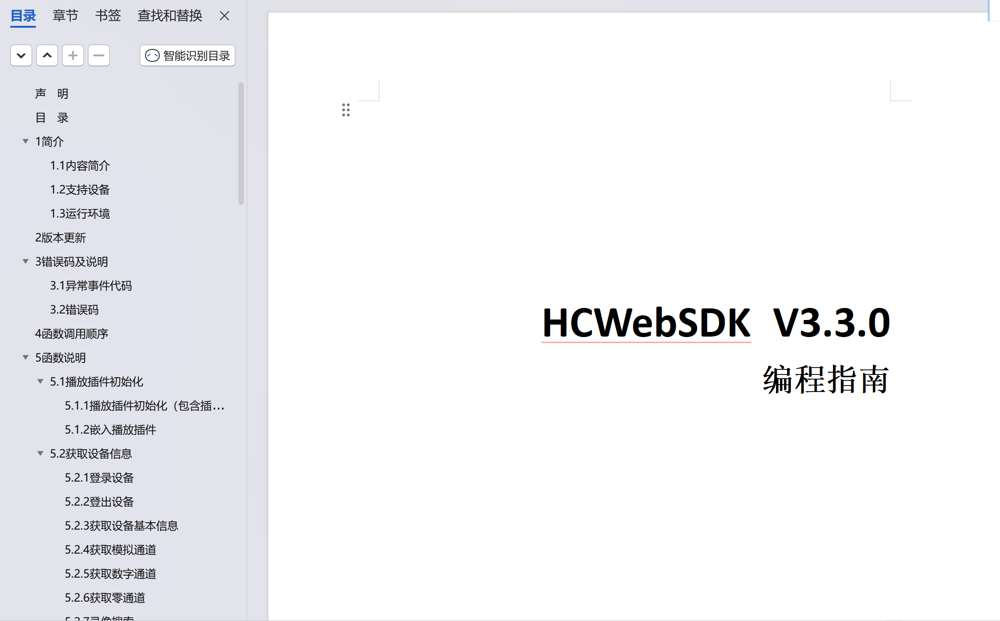
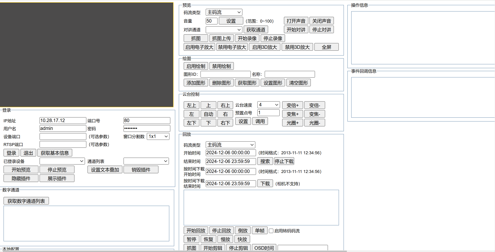
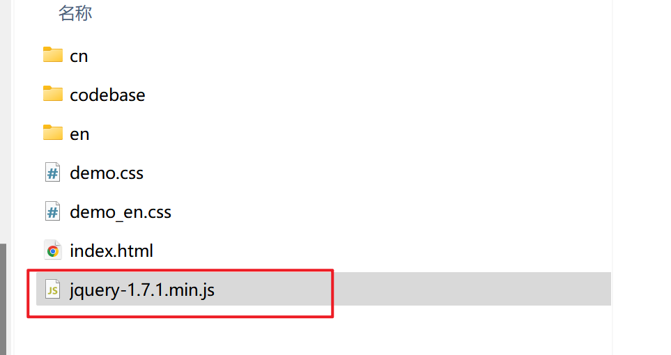
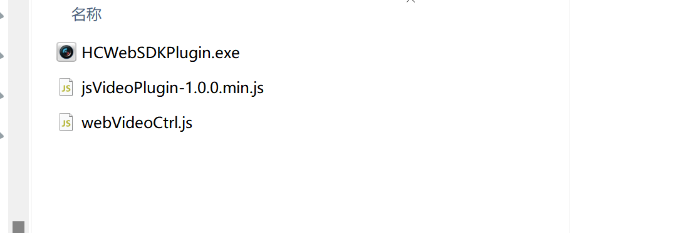
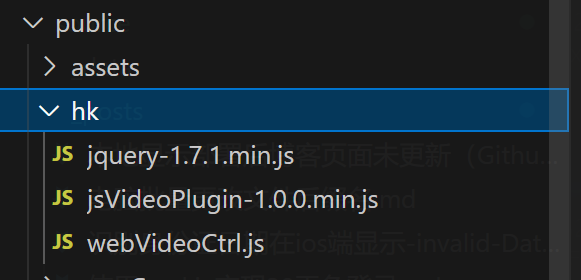

1.海康开放平台下载 WEB3.3 控件开发包 V3.3：
https://open.hikvision.com/download/5cda567cf47ae80dd41a54b3?type=10&id=4c945d18fa5f49638ce517ec32e24e24

2.下载后解压有三个文件夹

<div align="center">
  
</div>
第一个docs文件夹中有中英文海康sdk的编程指南，我们具体的功能实现就是对照这个文档做的
<div align="center">
  
</div>
第二个是nginx配置，暂时用不到
第三个中提供了一个demo和对应的插件
<div align="center">
  
</div>
首先需要把下图中的文件复制到项目public文件夹下
<div align="center">
  
</div>
<div align="center">
  
</div>
<div align="center">
  
</div>
之后在项目根目录的index.html文件中引入：
```
 <script src="/hk/jquery-1.7.1.min.js"></script>
  <script src="/hk/jsVideoPlugin-1.0.0.min.js"></script>
  <script src="/hk/webVideoCtrl.js"></script>
```
使用：
```
<script setup lang="ts">
import { onBeforeUnmount, onMounted, reactive, ref } from 'vue'
import { ElMessage } from 'element-plus'
import { DArrowLeft, DArrowRight } from '@element-plus/icons-vue'

onBeforeUnmount(() => {
destroyPlugin()
})
const tabPosition = ref('1')
const value = ref(new Date())

const formatTime = (date: any) => {
const hours = String(date.getHours()).padStart(2, '0')
const minutes = String(date.getMinutes()).padStart(2, '0')
const seconds = String(date.getSeconds()).padStart(2, '0')
return `${hours}:${minutes}:${seconds}`
}
const time = ref(formatTime(new Date()))
const data = reactive({
ip: import.meta.env.VITE_BASE_IP, //你的设备 ip
port: '80',
userName: import.meta.env.VITE_BASE_USERNAME, //账号
password: import.meta.env.VITE_BASE_PASSWORD //密码
})
var g_iWndIndex = 0
// 初始化插件参数及插入插件
const init = () => {
WebVideoCtrl.I_InitPlugin({
bWndFull: true, //是否支持单窗口双击全屏，默认支持 true:支持 false:不支持
iWndowType: 1,
cbSelWnd: function (xmlDoc: any) {
g_iWndIndex = parseInt($(xmlDoc).find('SelectWnd').eq(0).text(), 10)
        },
        cbDoubleClickWnd: function () {},
        cbEvent: (iEventType: any, iParam1: any) => {
            if (2 == iEventType) {
                // 回放正常结束
                console.log('窗口' + iParam1 + '回放结束！')
            } else if (-1 == iEventType) {
                console.log('设备' + iParam1 + '网络错误！')
            }
        },
        cbInitPluginComplete: function () {
            WebVideoCtrl.I_InsertOBJECTPlugin('divPlugin').then(
                () => {
                    // 检查插件是否最新
                    WebVideoCtrl.I_CheckPluginVersion().then((bFlag: any) => {
                        if (bFlag) {
                            alert('检测到新的插件版本，双击开发包目录里的HCWebSDKPlugin.exe升级！')
                        } else {
                            console.log('初始化成功')
                            login()
                        }
                    })
                },
                () => {
                    alert('插件初始化失败，请确认是否已安装插件；如果未安装，请双击开发包目录里的HCWebSDKPlugin.exe安装！')
                }
            )
        }
    })
}
// 销毁插件
const destroyPlugin = () => {
    console.log(WebVideoCtrl)
    WebVideoCtrl.I_Logout(`${data.ip}*${data.port}`).then(
() => {
console.log('退出成功')
WebVideoCtrl.I_DestroyPlugin()
},
() => {
console.log('退出失败！')
}
)
WebVideoCtrl.I_DestroyPlugin()
}

// 登录
const login = () => {
WebVideoCtrl.I*Login(data.ip, 1, data.port, data.userName, data.password, {
timeout: 3000,
success: function () {
getDevicePort(`${data.ip}*${data.port}`) //获取端口
},
error: function (error: any) {
console.log(error)
}
})
}
const channels: any = ref([])

//获取数字通道
const GetDigitalChannelInfo = (szDeviceIdentify: any) => {
if (!szDeviceIdentify) {
return
}
console.log('获取数字通道失败')
WebVideoCtrl.I*GetDigitalChannelInfo(`${data.ip}*${data.port}`, {
        async: false,
        success: (xmlDoc: any) => {
            let oChannels = xmlDoc.getElementsByTagName('InputProxyChannelStatus')
            console.log('获取数字通道成功', xmlDoc)
            for (let i = 0; i < oChannels.length; i++) {
                let id = oChannels[i].querySelector('id').firstChild.nodeValue
                let name = oChannels[i].querySelector('name').firstChild.nodeValue
                if ('' == name) {
                    name = 'Camera ' + (i < 9 ? '0' + (i + 1) : i + 1)
                }
                channels.value.push({
                    id: id,
                    name: name
                })
            }
            console.log(channels.value)
        },
        error: function (status: any) {
            console.log('获取数字通道失败', status)
        }
    })
}
// 获取端口
const getDevicePort = (szDeviceIdentify: any) => {
    if (!szDeviceIdentify) {
        return
    }
    WebVideoCtrl.I_GetDevicePort(szDeviceIdentify).then(
        (oPort: any) => {
            console.log('登录成功', oPort)
            // startRealPlay()
            GetDigitalChannelInfo(`${data.ip}_${data.port}`) //获取模拟通道
        },
        (oError: any) => {
            ElMessage.error(oError.errorMsg)
        }
    )
}
// 开始预览
const startRealPlay = () => {
    var oWndInfo = WebVideoCtrl.I_GetWindowStatus(g_iWndIndex)
    var startRealPlay = function () {
        WebVideoCtrl.I_StartRealPlay(`${data.ip}_${data.port}`, {
iStreamType: 1,
iChannelID: id.value, //播放通道
bZeroChannel: false,
success: function () {
console.log(' 开始预览成功！')
},
error: function (oError: any) {
console.log(' 开始预览失败！', oError.errorMsg)
}
})
}

    if (oWndInfo != null) {
        // 已经在播放了，先停止
        WebVideoCtrl.I_Stop({
            success: () => {
                startRealPlay()
            }
        })
    } else {
        startRealPlay()
    }

}

// 开始回放
const StartPlayback = () => {
var oWndInfo = WebVideoCtrl.I*GetWindowStatus(g_iWndIndex)
var StartPlayback = function () {
WebVideoCtrl.I_StartPlayback(`${data.ip}*${data.port}`, {
iStreamType: 1,
iChannelID: id.value, //播放通道
szStartTime: szStartTime.value,
// szEndTime: '',
success: function () {
console.log(' 开始回放成功！')
},
error: function (oError: any) {
console.log(' 开始回放失败！', oError.errorMsg)
}
})
}

    if (oWndInfo != null) {
        // 已经在播放了，先停止
        WebVideoCtrl.I_Stop({
            success: () => {
                StartPlayback()
            }
        })
    } else {
        StartPlayback()
    }

}
onMounted(() => {
init()
})

const formatDateToYYYYMMDD = (date: any) => {
// 获取年份，使用 getFullYear()方法
const year = date.getFullYear()

    // 获取月份，使用getMonth()方法，注意getMonth()返回的月份是从0开始的，所以需要加1
    const month = String(date.getMonth() + 1).padStart(2, '0')

    // 获取日期，使用getDate()方法
    const day = String(date.getDate()).padStart(2, '0')

    // 拼接成yyyy-mm-dd格式
    return `${year}-${month}-${day}`

}
const radioChange = (e: any) => {
if (e == 1) {
WebVideoCtrl.I_Stop({
success: () => {
// startRealPlay()
}
})
} else {
startRealPlay()
}
}
const valueChange = (e: any) => {
console.log(e)
}

const szStartTime = ref()
const buttonClick = () => {
szStartTime.value = formatDateToYYYYMMDD(value.value) + ' ' + time.value
StartPlayback()
console.log(szStartTime.value)
}
const id = ref('1')
const leftClick = (e: any) => {
id.value = e
if (tabPosition.value == '1') {
StartPlayback()
} else {
startRealPlay()
}
}

const stopText = ref('停止')
const stopClick = () => {
if (stopText.value == '停止') {
WebVideoCtrl.I_Pause({
success: () => {}
})
stopText.value = '播放'
} else {
WebVideoCtrl.I_Resume({
success: () => {}
})
stopText.value = '停止'
}
}
//加速播放
const PlayFastClick = () => {
WebVideoCtrl.I_PlayFast()
}
//减速播放
const PlaySlowClick = () => {
WebVideoCtrl.I_PlaySlow()
}
</script>

<template>
    <div class="main-box">
        <div style="margin-bottom: 30px; margin-left: 3vw">
            <el-radio-group v-model="tabPosition" @change="radioChange">
                <el-radio-button value="1">回放</el-radio-button>
                <el-radio-button value="2">预览</el-radio-button>
            </el-radio-group>
        </div>
        <div class="videobox" style="display: flex">
            <div class="left">
                <div style="margin-bottom: 2vh; font-weight: bold">设备列表</div>
                <div style="margin-bottom: 2vh; cursor: pointer" :style="{ color: item.id == id ? 'red' : '#fff' }" v-for="(item, index) in channels" :key="index" @click="leftClick(item.id)">{{ item.name }}</div>
            </div>
            <div class="center" :style="{ width: tabPosition == '1' ? '75%' : '100%' }">
                <div id="divPlugin" class="plugin" style="height: 70vh; width: 100%"></div>
                <div style="text-align: center; display: flex; justify-content: center; align-items: center" v-if="tabPosition == '1'">
                    <el-button :icon="DArrowLeft" @click="PlaySlowClick"></el-button>
                    <div class="iconBox" @click="stopClick">
                        
                        
                    </div>
                    <el-button :icon="DArrowRight" @click="PlayFastClick"></el-button>
                </div>
            </div>
            <div class="right" v-if="tabPosition == '1'">
                <el-calendar v-model="value" @date-change="valueChange" />
                <el-time-picker style="width: 100%; margin: 1vh 0" format="HH:mm" value-format="HH:mm" v-model="time" placeholder="请选择时间" />
                <el-button type="primary" @click="buttonClick">查找</el-button>
            </div>
        </div>
    </div>
</template>

<style scoped lang="less">
.videobox {
    color: #fff;
    display: flex;
    width: 100%;
    .left {
        width: 10%;
        display: flex;
        flex-direction: column;
        align-items: center;
    }
    .center {
        width: 65%;
    }
    .right {
        margin-left: 1%;
        width: 24%;
        height: 20vh;
        color: black;
        display: flex;
        flex-direction: column;
    }
}

.paginations {
    position: fixed;
    bottom: 5vh;
    right: 0;
    left: 0;
    display: flex;
    align-items: center;
    justify-content: center;
    .page {
        margin-right: 10px;
    }
}
.iconBox {
    cursor: pointer;
    width: 4vw;
    height: 32px;
    margin: 1vw;
    background: #fff;
    color: black;
    border-radius: 4px;
    display: flex;
    justify-content: center;
    align-items: center;
    img {
        width: 40%;
    }
}
::v-deep(.el-calendar-table .el-calendar-day:hover) {
    background-color: rgb(16, 28, 51);
    color: #fff;
}

::v-deep(.el-calendar-table td.is-selected) {
    background-color: rgb(20, 37, 74);
    color: #fff;
}
</style>


```
