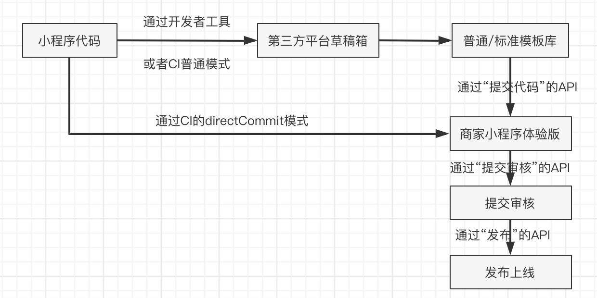

要实现微信小程序一套代码发布多个小程序可以使用第三方平台代开发的模式，把一套原始代码做成模板，分发多个小程序使用，微信官方文档:https://developers.weixin.qq.com/miniprogram/dev/devtools/ext.html
主要优点有：
效率更高
一个小程序模板可以批量提交给千千万的商家小程序
当小程序版本需要更新时，也可以批量更新
开发和管理的效率提高了，也间接降低了开发和管理的成本
更可靠
当商家小程序将开发权限授权给服务商之后，商家登录 mp 也将无法进行版本管理、域名配置等操作；一定程度上避免出现由于商家的误操作导致小程序业务故障或者不稳定
更快速
平台方在逐步推进更多的场景可按照小程序模板进行审核，模板审核通过之后，且商家小程序满足相关条件，则可加速通过审核
第三方平台进行小程序代开发流程：

  

在微信小程序开发时主要多了一个 ext.json 配置文件：https://developers.weixin.qq.com/miniprogram/dev/devtools/ext.html
